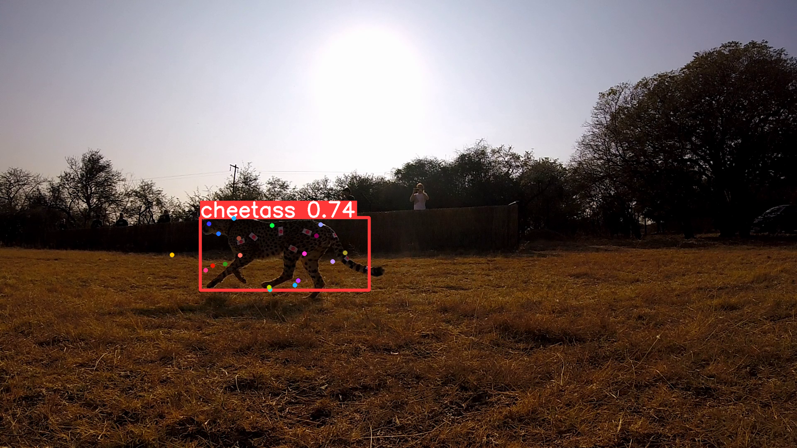

# Cheetah Keypoint Detection and Pose Estimation with YOLOv8

This project focuses on using the YOLOv8n-pose model for detecting keypoints and pose estimation of cheetahs using the **AcinoSet** dataset. The dataset consists of cheetah images with labeled keypoints. This repository includes all necessary scripts for preprocessing, converting annotations to YOLO format, training the model, and visualizing the results.

## Table of Contents

- [Introduction](#introduction)
- [Dataset](#dataset)
- [Preprocessing and Annotations](#preprocessing-and-annotations)
- [Model](#model)
- [Training](#training)
- [Visualization](#visualization)
- [Results](#results)
- [Installation](#installation)
- [Usage](#usage)
- [Contributors](#contributors)

## Introduction

The goal of this project is to perform pose estimation on cheetah images using the YOLOv8n-pose model. The dataset used is the AcinoSet dataset, which contains labeled keypoints for cheetahs. The project covers:
- Converting raw keypoint data into YOLO format
- Training the YOLOv8n-pose model
- Visualizing bounding boxes and keypoints on cheetah images

## Dataset

The dataset used for this project is **AcinoSet**, available on [PapersWithCode](https://paperswithcode.com/dataset/acinoset).

### Dataset Structure

- **Images**: Cheetah images with varying poses and actions.
- **Annotations**: Keypoints of the cheetah body in CSV format, which are converted into YOLO annotation format during preprocessing.

## Preprocessing and Annotations

### Data Preprocessing

The keypoint coordinates in the dataset are in CSV format. These coordinates are converted into YOLOv8 format for training. The following steps are performed:

- Normalization of keypoint coordinates
- Generation of bounding boxes for each image
- Creation of YOLO-compatible `.txt` files for keypoints and bounding boxes

Key functions include:
- `convert_to_yolo_format()`: Converts pixel coordinates into YOLO's normalized format.
- `write_yolo_annotation()`: Writes the annotations into `.txt` files.

## Model

The model used is **YOLOv8n-pose**, which is a specialized version of the YOLO (You Only Look Once) model for keypoint detection and pose estimation.

YOLOv8n-pose is trained to detect both bounding boxes and keypoints in a single forward pass.

## Training

The training process involves using the converted YOLO-formatted dataset with keypoints and bounding boxes.

- Training data: A split of the AcinoSet dataset into training and validation sets.
- Model: YOLOv8n-pose
- Evaluation: Mean Average Precision (mAP) and Keypoint Localization Accuracy (KLA) for model evaluation.

### Steps:
1. Install dependencies (see [Installation](#installation))
2. Run the preprocessing script to convert raw annotations to YOLO format
3. Train the model using the YOLOv8 framework

## Visualization

After training, the model's output can be visualized by plotting the bounding boxes and keypoints on the cheetah images.

Key scripts for visualization:
- `visualize_yolo_example()`: Visualizes bounding boxes and keypoints on sample images.
- `visualize_random_yolo_annotations()`: Randomly selects images from the dataset and plots their bounding boxes and keypoints for inspection.

## Results

### Sample Visualizations



### Metrics

- **mAP (Mean Average Precision)**: TBD
- **Keypoint Localization Accuracy**: TBD

## Installation

To set up the project, follow these steps:

1. Clone the repository:
   ```bash
   git clone https://github.com/username/repository_name.git
